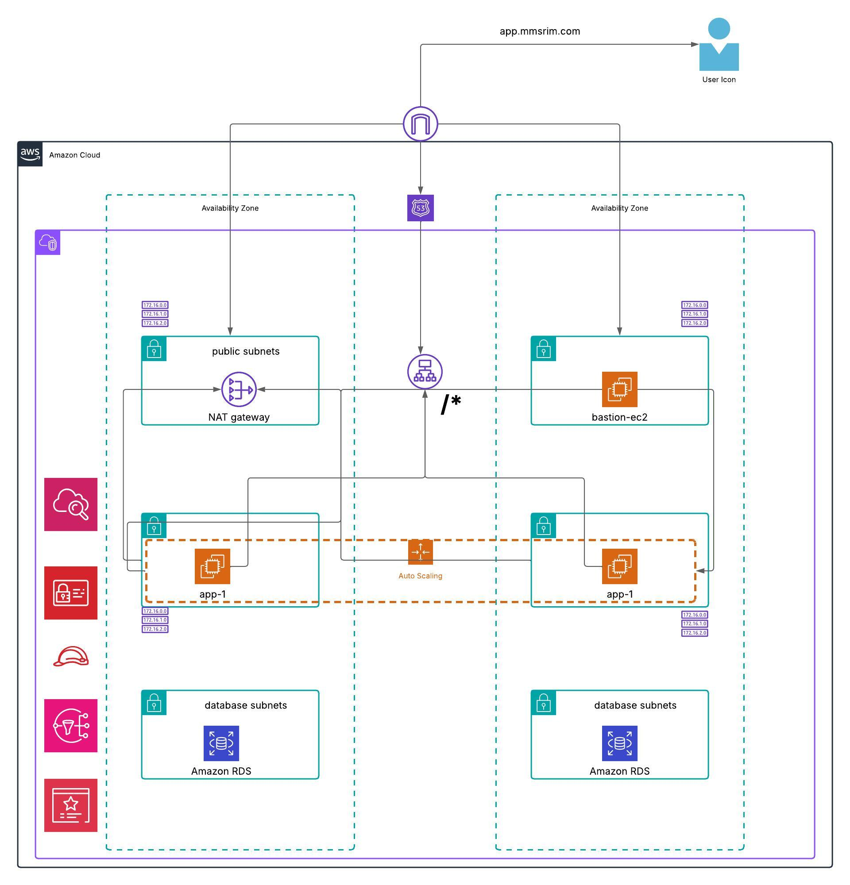

# 🚀 AWS Infrastructure Deployment Using Terraform

## 📌 Overview
This project provisions a **highly available and secure AWS infrastructure** using **Terraform**. It includes the following AWS services:

✅ **Networking & Security:** VPC, Public/Private Subnets, Security Groups, NAT Gateway, IAM  
✅ **Compute & Auto Scaling:** EC2 Instances, Bastion Host, Auto Scaling Group (ASG)  
✅ **Load Balancing & SSL:** Application Load Balancer (ALB) with HTTPS via AWS Certificate Manager (ACM)  
✅ **Monitoring & Alerting:** AWS CloudWatch, CloudWatch Alarms, CloudWatch Synthetics  
✅ **DNS & Routing:** Amazon Route 53 for custom domain names  
✅ **Notifications:** Amazon SNS for Email Alerts  

---

## 📷 Architecture Diagram

---

## 🏗️ Infrastructure Components

### **1️⃣ Networking & Security**
- **Amazon VPC** with Public and Private Subnets.
- **NAT Gateway** for internet access to private instances.
- **Security Groups** for controlled access.
- **Bastion Host** for secure SSH access to private instances.

### **2️⃣ Compute Resources**
- **Auto Scaling Group (ASG)** with private EC2 instances.
- **Bastion Host** for administrator access.

### **3️⃣ Load Balancing & SSL**
- **Application Load Balancer (ALB)** for traffic distribution.
- **AWS Certificate Manager (ACM)** for HTTPS/SSL.
- **Amazon Route 53** for DNS.

### **4️⃣ Monitoring & Logging**
- **CloudWatch Alarms** for CPU, memory, disk, and network monitoring.
- **CloudWatch Logs** for EC2 and ALB logs.
- **CloudWatch Synthetics** for application health monitoring.

### **5️⃣ Notifications & Alerts**
- **Amazon SNS** to send email alerts on failures.

